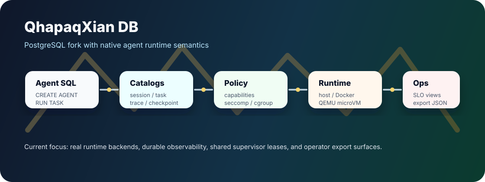

# QhapaqXian DB



QhapaqXian DB is a PostgreSQL `REL_17_STABLE` fork that makes agents first-class database runtime objects: grammar, catalogs, policy, scheduler, recovery, real backend execution, receipts, and operator observability live inside the server boundary.

It is not an extension. It is not middleware. It is an AgentDB fork.

## Current state

- Active branch: `bootstrap`
- Canonical status ledger: [STATUS.md](STATUS.md)
- Real backend guide: [docs/real-runtime-backends.md](docs/real-runtime-backends.md)
- Documentation map: [docs/README.md](docs/README.md)
- Fork naming and governance: [QHAPAQXIAN.md](QHAPAQXIAN.md)

Latest landed spine:


## What is in-tree now

| Area | Landed surface |
| --- | --- |
| Agent SQL | `CREATE AGENT`, `START SESSION`, `RUN TASK`, native parser/utility integration |
| Durable state | `pg_qx_*` catalogs for agents, sessions, tasks, attempts, steps, events, traces, checkpoints, scheduler ledgers, and stat history |
| Policy | namespace policies, tool capabilities, provider/principal contracts, attestation modes |
| Runtime backends | host, Docker/container, and QEMU microVM contract paths |
| Hardening | cgroup/seccomp policy compilation, image/asset allowlists, shared backend supervisor leases |
| Observability | `pg_stat_qx_*` views, durable stat snapshots, SLO provider rollups, operator dashboard/export views |
| Recovery | startup/failover scans, semantic checkpoint replay, scheduler ledger surfaces |

## Quick orientation

Read in this order:

1. [STATUS.md](STATUS.md) — current truth, test evidence, known gaps.
2. [docs/README.md](docs/README.md) — full documentation map.
3. [docs/qhapaqxian-architectural-blueprint.md](docs/qhapaqxian-architectural-blueprint.md) — target architecture and thesis.
4. [docs/real-runtime-backends.md](docs/real-runtime-backends.md) — Docker/QEMU/WSL/KVM setup.
5. [docs/testing-bootstrap.md](docs/testing-bootstrap.md) — regression lanes and validation policy.

## Build and test

This repository keeps PostgreSQL’s build shape. Existing Meson/Ninja workflows apply.

Common local validation:

```powershell
ninja -C build-stage4-codex -j 2
meson test -C build-stage4-codex --suite postgresql:setup --print-errorlogs
meson test -C build-stage4-codex --suite postgresql:qhapaqxian_output --print-errorlogs
meson test -C build-stage4-codex regress/regress --print-errorlogs
```

For real Docker/QEMU backend checks, set the runtime environment described in [docs/real-runtime-backends.md](docs/real-runtime-backends.md).

## Operator surfaces

Useful QhapaqXian views/functions include:

- `pg_stat_qx_operator_dashboard`
- `pg_stat_qx_operator_export`
- `pg_stat_qx_backend_supervisor`
- `pg_stat_qx_stat_history`
- `pg_qx_stat_snapshot(text)`
- `pg_qx_stat_prune_history(timestamptz)`
- `pg_qx_policy_compile_container(text)`

## Repository rules

- `STATUS.md` wins for current state.
- Stage docs are historical/local contracts; they do not override `STATUS.md`.
- Product identity is QhapaqXian DB. Upstream PostgreSQL naming remains only where bootstrap compatibility requires it.
- JavaScript/TypeScript package work, if ever needed, uses `pnpm`.

## Known next work

The current bootstrap is usable for continued implementation and validation. Remaining platform work is tracked in [STATUS.md](STATUS.md), especially deeper external process lifecycle ownership, stronger OCI/rootless policy ownership, longer-horizon operator retention/export automation, and ongoing doc normalization.
