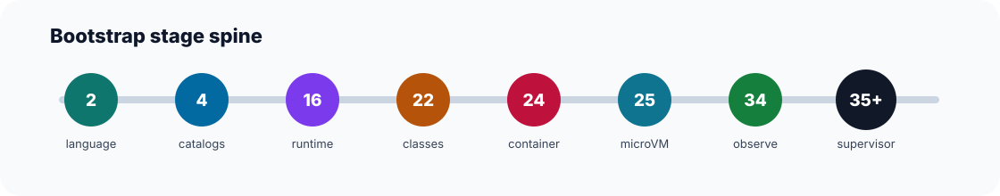

# QhapaqXian DB Documentation Map

This file is the canonical map of the repository documentation tree.

Use these documents in this order:
- [README.md](../README.md) for repository entry and quick orientation
- [STATUS.md](../STATUS.md) for the canonical current-state ledger
- [QHAPAQXIAN.md](../QHAPAQXIAN.md) for naming, fork boundary, and governance
- [qhapaqxian-architectural-blueprint.md](./qhapaqxian-architectural-blueprint.md) for target architecture and thesis

Documentation roles:
- `README.md`: short entrypoint only
- `STATUS.md`: current landed state and stage matrix
- `QHAPAQXIAN.md`: naming, boundary, and bootstrap governance
- `docs/README.md`: map of the documentation tree
- `docs/qhapaqxian-architectural-blueprint.md`: target design, not a status ledger
- `docs/adr/*.md`: durable architectural decisions
- `docs/stage-*/README.md`: stage-local landed contracts and historical implementation notes
- operational docs under `docs/`: process, testing, release, maintenance, and patch-cost runbooks
- `src/backend/qx/**/README.md` and `src/include/qx/README.md`: subsystem-level implementation boundaries

Recommended reading paths:
- Current repo state:
  - [STATUS.md](../STATUS.md)
  - [README.md](../README.md)
  - [QHAPAQXIAN.md](../QHAPAQXIAN.md)
- Architecture and fork thesis:
  - [qhapaqxian-architectural-blueprint.md](./qhapaqxian-architectural-blueprint.md)
  - [adr/0001-fork-thesis.md](./adr/0001-fork-thesis.md)
  - [adr/0002-upstream-baseline.md](./adr/0002-upstream-baseline.md)
  - [adr/0003-branding-boundary.md](./adr/0003-branding-boundary.md)
  - [adr/0004-catversion-policy.md](./adr/0004-catversion-policy.md)
  - [adr/0005-real-runtime-backends.md](./adr/0005-real-runtime-backends.md)
- Stage history and implementation phases:
  - [stage-template.md](./stage-template.md)
  - [stage-2/README.md](./stage-2/README.md)
  - [stage-4/README.md](./stage-4/README.md)
  - [stage-9/README.md](./stage-9/README.md)
  - [stage-16/README.md](./stage-16/README.md)
  - [stage-22/README.md](./stage-22/README.md)
  - [stage-23/README.md](./stage-23/README.md) through [stage-35/README.md](./stage-35/README.md)
- Operations and maintenance:
  - [bootstrap-plan.md](./bootstrap-plan.md)
  - [patch-ledger.md](./patch-ledger.md)
  - [real-runtime-backends.md](./real-runtime-backends.md)
  - [runtime-troubleshooting.md](./runtime-troubleshooting.md)
  - [rebase-strategy.md](./rebase-strategy.md)
  - [release-bootstrap.md](./release-bootstrap.md)
  - [release-policy.md](./release-policy.md)
  - [testing-bootstrap.md](./testing-bootstrap.md)

Interpretation rules:
- if a document sounds like a shipped feature, confirm it in [STATUS.md](../STATUS.md)
- if two documents conflict on current state, [STATUS.md](../STATUS.md) wins
- if two documents conflict on target design, the blueprint or the relevant ADR wins
- older stage docs are additive history; they do not override the current-state ledger

Stage normalization status:
- stages 2-12 use the early bootstrap shape and remain historical context
- stages 13-21 cover security/runtime bootstrap and should be read with the current stage matrix open
- stages 22-35 are the current runtime/observability spine and are the preferred implementation trail
- new stage docs should follow [stage-template.md](./stage-template.md)
